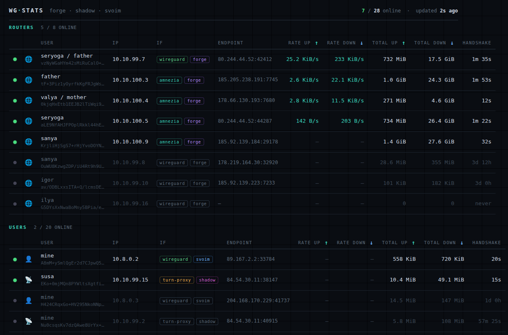

# wg-stats
<<<<<<< HEAD
Lightweight, multi-node peer dashboard for WireGuard, AmneziaWG and Turn-Proxy. A Python collector on each node samples interfaces, pushes a JSON snapshot over rsync, and a single HTML page renders online status, throughput and handshakes in real time.
=======

**English** · [Русский](README.ru.md)



A simple, self-hosted dashboard that shows the live status of your
**WireGuard / AmneziaWG** peers across one or more servers — who is online,
their speed, total traffic, and time since last handshake. Each server runs a
small Python script that reads its tunnels and sends a snapshot to one "viewer"
server; a single web page shows everything, refreshing every couple of seconds.

No database, no framework, no build step — three parts: a collector script (one
per server), some JSON files, and one HTML page.

## How it works

```
  server 1 ── collector.py ─┐
  server 2 ── collector.py ─┤  copies stats over SSH  ►  viewer server (nginx)
  server 3 ── collector.py ─┘                              ├── index.html     ← the dashboard
                                                            ├── users.json     ← who's who (private)
                                                            └── stats-*.json   ← uploaded by collectors
                                                                      ▲
                                                          your browser refreshes it
```

1. On each server, `collector.py` reads `wg`/`awg show … dump`, works out each
   peer's speed, and writes `stats-<name>.json`.
2. It copies that file to the viewer server with `rsync` over SSH.
3. `index.html` (served by nginx on the viewer) loads `users.json` (names and
   colours) and every `stats-*.json`, and shows a live table.

## What's in this repo

| file | where it goes | what it is |
|------|---------------|-----------|
| `index.html` | viewer server | the dashboard page |
| `users.example.json` | viewer server | example roster — copy to `users.json` |
| `collector.py` | each node | reads tunnels, uploads stats |
| `wg-stats-collector.service` | each node | runs the collector in the background |
| `nginx.conf.example` | viewer server | example web-server config |
| `.gitignore` | — | keeps private files out of git |

## Before you start

You need:

- **One "viewer" server** with nginx and a domain name — this hosts the web page.
  It can be one of your existing servers.
- **One or more "nodes"** — the servers running WireGuard/AmneziaWG you want to watch.
- Root / `sudo` on each, plus `python3` and `rsync` (usually already installed).

The viewer can also be one of the nodes — that's fine.

---

## Part A — Set up the viewer server

**1. Create a folder and copy the web files into it:**
```bash
sudo mkdir -p /opt/wg-stats
sudo cp index.html users.example.json /opt/wg-stats/
```

**2. Create the real roster from the example:**
```bash
sudo cp /opt/wg-stats/users.example.json /opt/wg-stats/users.json
```

**3. Put the page behind a password** (so it isn't public):
```bash
sudo apt install -y apache2-utils
sudo htpasswd -c /etc/nginx/wg-stats.htpasswd myusername
```

**4. Add the nginx site.** Open `nginx.conf.example`, replace the `YOUR_...`
placeholders (your domain, port, and TLS certificate paths — if you don't have
certificates yet, [certbot](https://certbot.eff.org/) can get them free), then:
```bash
sudo nano /etc/nginx/sites-available/wg-stats     # paste the edited config
sudo ln -s /etc/nginx/sites-available/wg-stats /etc/nginx/sites-enabled/
sudo nginx -t && sudo systemctl reload nginx
```

Open your domain in a browser — you should see the dashboard (empty for now, and
asking for the password you just set).

---

## Part B — Configure the dashboard

Edit `/opt/wg-stats/index.html` and find the **CONFIG** block near the top.

**1. List your servers (`NODES`)** — one line each:
```js
const NODES = {
  "berlin": { file:"stats-berlin.json", color:"#b387f5" },
  "paris":  { file:"stats-paris.json",  color:"#6cb6ff" },
};
```
- The **key** (`"berlin"`) is the label shown on the badge and decides its colour.
- **`file`** must match the filename that server's collector produces (you set
  that in Part C). If the collector writes `stats-berlin.json`, put
  `file:"stats-berlin.json"` here.
- `color` is the badge colour while the server is online. `border` and `label`
  are optional.

**2. Turn-proxy IPs (`TURN_IPS`)** — only if you use a turn-proxy. List the
public IPs; peers connecting through them get a 📡 tag. Otherwise leave the
placeholder:
```js
const TURN_IPS = ["203.0.113.10"];
```

**3. Unlisted peers (`SHOW_UNLISTED`)** — leave it `false` so only people listed
in `users.json` appear.

Now edit `/opt/wg-stats/users.json` — it maps each peer's public key to a name:
```json
{
  "<public key>": { "name": "Alice", "ip": "10.0.0.2", "if": "wg0", "type": "user", "node": "berlin" }
}
```

| field | meaning |
|-------|---------|
| `name` | the name shown |
| `ip` | tunnel IP (optional) |
| `if` | interface (`wg…` shows as "wireguard", `awg…` as "amnezia") |
| `type` | `user` or `router` — two separate tables |
| `node` | which server — must match a `NODES` key |

Find a peer's public key with `wg show <interface>` (or `awg show <interface>`)
on the server.

---

## Part C — Set up a collector on each node

Do this on **every** server you want to monitor.

**1. Copy the files:**
```bash
sudo mkdir -p /opt/wg-stats
sudo cp collector.py /opt/wg-stats/
sudo cp wg-stats-collector.service /etc/systemd/system/
```

**2. Make an SSH key** so this server can upload to the viewer, and authorise it there:
```bash
sudo ssh-keygen -t ed25519 -f /root/.ssh/wg-stats_ed25519 -N ""
sudo ssh-copy-id -i /root/.ssh/wg-stats_ed25519.pub -p YOUR_PORT user@VIEWER_IP
```

**3. Edit the CONFIG block in `collector.py`:**
```python
INTERFACES = [("wg0", ["wg"])]                  # your interface(s) and tool
NODE       = "berlin"                            # this server's short name -> stats-berlin.json
RSYNC_DEST = "user@VIEWER_IP:/opt/wg-stats/"
SSH_KEY    = "/root/.ssh/wg-stats_ed25519"
SSH_PORT   = "22"
```
- `INTERFACES` — each entry is `(interface_name, command)`. Use `["awg"]` for
  AmneziaWG, `["wg"]` for WireGuard, or `["docker","exec","<container>","wg"]` if
  it runs inside Docker (e.g. wg-easy).
- `NODE` — becomes the filename `stats-<NODE>.json`, and **must match** the
  `file:` you set in `index.html`.

**4. Test it by hand first:**
```bash
sudo python3 /opt/wg-stats/collector.py
```
Let it run a few seconds, then Ctrl-C. On the viewer, check that
`stats-<NODE>.json` appeared in `/opt/wg-stats/`.

**5. Run it as a background service:**
```bash
sudo systemctl daemon-reload
sudo systemctl enable --now wg-stats-collector
sudo journalctl -u wg-stats-collector -f          # watch for errors
```

Repeat on each server, then refresh the dashboard — your peers should appear.

---

## Security — please read

**`users.json` links public keys to real people. Treat it like a password file.**

- **Never** commit `users.json`, private keys, the password file, or live
  `stats-*.json` to git. The included `.gitignore` already blocks them — run
  `git status` before your first commit to be sure none are listed.
- Keep the dashboard behind the password **and** HTTPS — it is a list of your users.
- In anything you publish, use placeholders instead of real IPs, ports, and domains.

## Troubleshooting

| symptom | what to do |
|---------|-----------|
| a server shows **"down"** | the viewer can't read its stats file — check the collector is running and rsync works (`journalctl -u wg-stats-collector`) |
| a server shows **"stale"** | the collector stopped, or its uploads are failing |
| **403** on a stats file | nginx can't read it; the collector uploads with `--chmod=F644`, and `/opt/wg-stats` must be readable by nginx |
| **roster empty** / users.json error | `users.json` is missing or not valid JSON |
| a peer shows a long code, not a name | it isn't in `users.json` (or `SHOW_UNLISTED` is `true`) |

## License

MIT — see [`LICENSE`](LICENSE).
>>>>>>> 1ad2695 (wg-stats: multi-node wg/awg dashboard)
